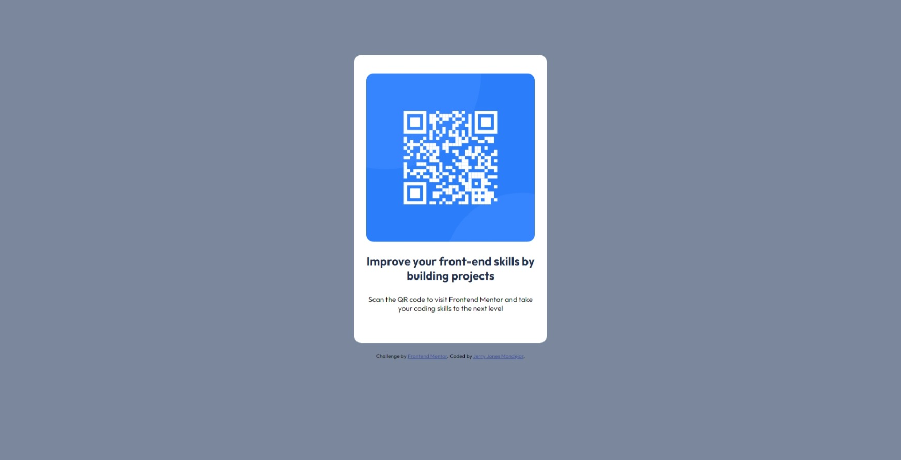

# Frontend Mentor - QR code component solution

This is a solution to the [QR code component challenge on Frontend Mentor](https://www.frontendmentor.io/challenges/qr-code-component-iux_sIO_H). Frontend Mentor challenges help you improve your coding skills by building realistic projects. 

## Table of contents

- [Overview](#overview)
  - [The challenge](#the-challenge)
  - [Screenshot](#screenshot)
  - [Tools](#built-with)
  - [Links](#links)
- [Author](#author)

## Overview

### Screenshot

Desktop View

Mobile View

## My process

### Built with

- Semantic HTML5 markup
- CSS custom properties
- Flexbox

### Links

- Solution URL: [https://github.com/DevDiones/Recipe-Page](https://github.com/DevDiones/Recipe-Page)
- Live Site URL: [https://devdiones.github.io/Recipe-Page/](https://devdiones.github.io/Recipe-Page/)

## Author

- Frontend Mentor - [@DevDiones](https://www.frontendmentor.io/profile/DevDiones)
